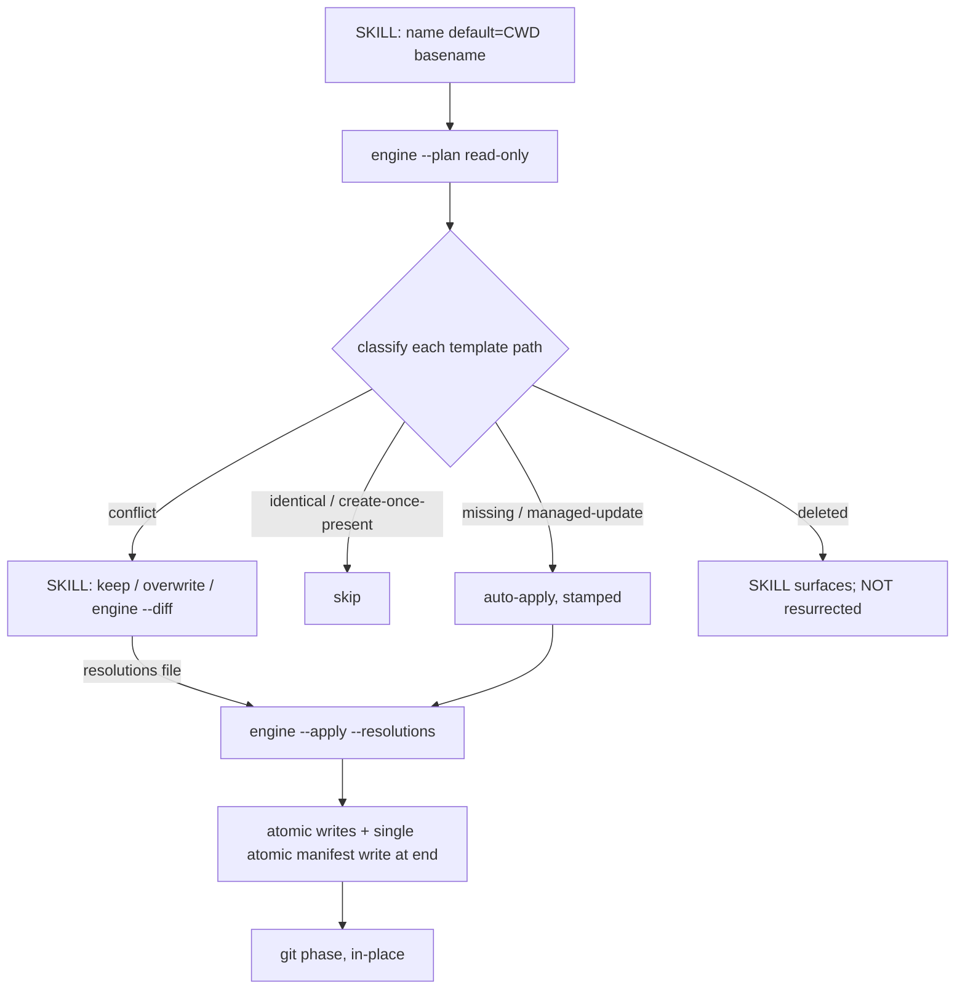

# init-project in-place gap-filling scaffolder

## Overview

Redesign the `/init-project` scaffold engine (`plugins/init-project/scaffold.sh` + `SKILL.md`) from a **greenfield, refuse-on-collision** tool into an **in-place, gap-filling** one.

Today the engine writes its `templates/` tree into a fresh `./<project-name>/` subdirectory and **aborts** the moment any template path collides with an existing file (`scaffold.sh:196-211`). Two changes invert that:

1. **In-place** — scaffold into the **current directory** (`.`), not `./<name>/`. The project name (still needed for `__SCAFFOLD_PROJECT_NAME__` substitution) defaults to the CWD basename (validated `^[a-z0-9][a-z0-9-]*$`), overridable by an explicit arg.
2. **Gap-filling** — detect which template files are already present and **add only what is missing**. When a user-owned file differs from the template (a **CONFLICT**), default to **keeping the user's file** and **ask** per file (keep / overwrite / show diff). Gap-fill becomes the **default**; strict refuse-on-non-empty is retired.

This deliberately **revises fn-2 R2 and R6** and supersedes the two-mode prose at `fn-2 …:67`, while preserving fn-2 R23 (copy + token-substitute contract) and all of fn-3's `--local-llm` behavior.

## Architecture: deterministic engine, interactive skill

The engine stays non-interactive and deterministic; the **skill** owns all user interaction (matching the existing convention — all prompting lives in `SKILL.md` prose; the engine never `read`s).



- **`--plan`** (evolves `--dry-run`, `scaffold.sh:218-222`): read-only. Emits machine-readable JSON classifying every planned path. **Hand-emitted (no `jq`)** so a plain scaffold stays jq-free (fn-3 contract).
- **`--apply`**: writes per the classification + the skill's resolutions. Atomic temp-rename within the target dir (mirror `build-config.sh:446-486`).
- **`--diff <path>`**: for a **text** conflict prints a unified diff (on-disk vs stamped template) with secret/volatile-derived lines **redacted**; for a **binary** conflict prints a deterministic "binary files differ" report (no byte dump). jq-free.

## Classification taxonomy (the core, novel logic)

`--plan` assigns each planned template path one status (+ a `reason`), comparing the **stamped template** to the **on-disk file**, using the prior manifest's recorded sha256 as the ownership oracle. Non-volatile content is compared after **normalization** (strip trailing whitespace, force LF) so trailing-newline/CRLF differences never trigger a conflict.

| Status | Condition | Action |
|--------|-----------|--------|
| `missing` | absent on disk, not manifest-recorded | auto-apply (stamp + write) |
| `identical` | present, non-volatile, normalized == current template | skip |
| `managed-update` | present, non-volatile, == recorded manifest hash but != current template (template evolved, user didn't edit) | auto-apply (overwrite), **no prompt** |
| `conflict` | present, non-volatile, differs from current template AND (no manifest record OR != recorded hash) — i.e. user-edited/owned | **ask** (keep-mine default) |
| `create-once-present` | present, **volatile** (contains `__SCAFFOLD_GEN_URLSAFE__`), not `config.json` | skip (never diffed) |
| `merge` | `config.json` present **and manifest-owned** | structured-merge (needs `jq`), auto |
| `conflict` (unowned config) | `config.json` present **but NOT manifest-owned** (likely the user's own/unrelated) | **ask** (keep-mine default; skill may offer `overwrite` or `merge`) — never auto-merged |
| `deleted` | manifest-recorded, **still in the current template plan**, absent on disk (user deleted) | surface; **NOT** auto-resurrected (restore only via explicit `restore` resolution — there IS a template to stamp) |
| `retired` | manifest-recorded, **not in current plan**, present, **hash == recorded** (unedited, ours) | prune (manifest-owned only — the fn-3 local-LLM-removal case) |
| `retired-conflict` | manifest-recorded, **not in current plan**, present, **hash != recorded** (user edited) | **keep by default**; removed only via an explicit `delete` resolution (never silent delete of a user-edited file) |
| `gone` | manifest-recorded, **not in current plan**, absent on disk | no file action; **drop** from new manifest |

Two hazards this resolves (copier/yeoman; practice-scout):

- **Generated-secret files are create-once / never hash-diffed.** Any template containing `__SCAFFOLD_GEN_URLSAFE__` re-stamps to a *fresh* secret every run, so naive comparison is a guaranteed false conflict. Absent → write once; present → `create-once-present` skip, except `config.json` → structured-merge. Secret/volatile-derived lines are redacted in `--diff`.
- **Manifest is the ownership oracle, written as an OUTPUT.** `managed-update` vs `conflict` is decided by the recorded hash (== recorded → we own it, safe to update; != recorded → user edited → ask). A recorded-but-absent path is `deleted` and never silently re-added.

## jq dependency boundary (preserves fn-3)

`--plan`, `--diff`, resolutions parsing, and a **first/clean scaffold** (config.json `missing` → stamped) are all **jq-free**. `jq` is preflighted **only** when a `config.json` structured-merge actually runs (config.json present + reconciled) or `--local-llm` is set — with a clear error naming jq. This keeps fn-3's "a plain scaffold needs no jq" contract intact.

## Engine ↔ skill contracts

- **`--plan` output:** JSON array `[{"path","status","reason"}]` over the **union of current template paths and prior-manifest paths** (so `deleted`/`retired`/manifest-only entries surface), hand-emitted (paths are repo-relative, safe to emit). The skill reads this directly (agent-read, no `jq`).
- **`--resolutions <file>`:** jq-free text, one `<action>\t<path>` per line; `action ∈ {keep, overwrite, restore, merge, delete}`. keep/overwrite must target a currently-classified `conflict`; `restore` a `deleted` path; **`merge` only an unowned-`config.json` `conflict`**; **`delete` only a `retired-conflict`** (removes the user-edited orphan on explicit request). The engine validates each path is within the CWD and status-appropriate; unknown / out-of-CWD / invalid-action / wrong-status / duplicate → exit 64.
- **Output channels:** during `--plan` stdout carries ONLY the JSON array; during `--apply` stdout carries ONLY tab-separated touched-path report lines (`<verb>\t<path>`, verb ∈ `wrote|deleted|merged|restored|chmod|manifest`). All human/diagnostic prose goes to **stderr** so the skill can parse stdout deterministically.
- **`--on-conflict keep|overwrite|fail`:** global default for paths not in the resolutions file (default `keep`); `fail` exits non-zero if any conflict is unresolved (CI guard).
- **`--diff <path>`:** unified diff for a text conflict (redacted) / deterministic "binary files differ" report for a binary conflict.

## Manifest write semantics (atomic)

Load the prior manifest into memory; build the new manifest per the R6 per-entry rule — **newly-written hash** for writes/`managed-update`/`overwrite`/restore/config; **current hash** for `identical` + previously-owned `create-once-present`; **prior entry preserved verbatim** for a kept-but-previously-owned `conflict` and a declined `deleted` (so neither is ever re-classified into an overwrite); **omitted** for a kept-unowned conflict; **dropped** for `retired`-pruned and not-in-plan-absent paths. Write the manifest **once, atomically (temp+rename), at the very end** after all file writes succeed. A mid-run failure leaves the prior manifest intact — no partial/false ownership claims. **The recorded hash must never be derived from user-edited content** (else a kept conflict becomes a silent `managed-update` overwrite next run).

## config.json precedence (explicit)

0. **Ownership gate:** auto-merge (and `--replace-config`'s stamped overwrite) apply ONLY to a **manifest-owned** `config.json`; an **unowned** present `config.json` (arbitrary in-place repo) is a prompted `conflict` (keep-mine; skill may offer `merge`/`overwrite`), never silently merged or overwritten — even under `--replace-config`.
1. **Base** (when merging) = structured-merge: operator edits + existing generated secrets win over the template (new non-secret keys + systems[] by name are added).
2. **`--local-llm` this run** → its mutation is applied **last and intentionally wins** (so a user CAN opt in, or change the model, on a re-run).
3. **Non-opt-in reset** (drop `localLlm`, restore real-provider URLs) applies **only** when prior-opt-in manifest evidence exists AND `--local-llm` is absent.

(This matches the existing engine ordering — mutation applied last, `scaffold.sh:282`; reset gated on `prior_llm_files`, `:312`.)

## Quick commands

```bash
bash plugins/init-project/tests/scaffold_test.sh            # kcov 100% line gate
( cd /tmp/existing-repo && bash /abs/scaffold.sh demo "d" --plan )   # JSON verdicts, no writes, no jq
shellcheck plugins/init-project/scaffold.sh && bash -n plugins/init-project/scaffold.sh
```

## Boundaries / non-goals

- **No git 3-way merge** of conflicting files (copier-style inline markers). Conflicts are keep/overwrite/diff per file — not merged.
- **No change to template content** — only how/where they're laid down and reconciled.
- **No extension of fn-3's `--local-llm`** — preserved, not extended.
- **No `stamp_file` perf rework** — the known O(n^2) `stamp_file` (~75s/scaffold) is a separate follow-up; don't make it materially worse.
- **The retired subdir mode is not kept as a flag** — in-place is the only behavior.

## Decision context

- **Gap-fill as default, strict retired** (locked): `--force`/strict/`--update` collapse into the single gap-fill+merge default; a re-run re-syncs manifest-owned files (`managed-update`) and gap-fills the rest. `--replace-config` (secret rotation) retained.
- **Keep-mine + ask on CONFLICT** (locked): never default to overwrite (yeoman's hard-learned lesson). `--on-conflict` (default `keep`) supports headless runs.
- **Engine emits JSON + diffs, skill prompts**: keeps the engine deterministic/unit-testable; the `--plan`/`--apply`/`--diff`/`--resolutions` contracts are the interface.
- **jq-free hot path**: `--plan`/`--diff`/resolutions hand-emit/parse without jq so fn-3's plain-scaffold-needs-no-jq contract survives.

## Acceptance Criteria

- **R1:** The engine **applies in place into the current directory** (no `./<name>/` subdir; landed in .2). **CLI grammar** (final): `scaffold.sh [--name <name>] "<description>" {--plan | --apply [--resolutions <file>] [--on-conflict keep|overwrite|fail] | --diff <path>} [--replace-config] [--local-llm …]` — a **single positional = description**; the project name is the **`--name` flag**, defaulting to the **CWD basename** (validated `^[a-z0-9][a-z0-9-]*$`); default mode (no mode flag) = `--apply`. The engine never reads/writes `.git/` (it stats per-template paths under CWD, never descending `.git`); resolved paths outside CWD (`..`/absolute) are rejected.
- **R2:** A read-only **`--plan`** pass emits **hand-built JSON** (no `jq`) classifying the **union of current template paths and prior-manifest-recorded paths** (so `deleted` and manifest-only entries surface, not just current-plan paths) — each with one taxonomy status + `reason` — and writes nothing. (Evolves `--dry-run`.)
- **R3:** Classification implements the full taxonomy (`missing`, `identical`, `mode-update`, `managed-update`, `conflict`, `create-once-present`, `merge`, `deleted`, `retired`, `retired-conflict`, `gone`). `mode-update` = content-`identical` but the exec bit differs from the template (chmod-only, auto-applied — see R7), carried in `--plan` as its own status (or a `mode_drift:true` field). **Text** files (token-bearing / detected text) compare after normalization (trailing-whitespace strip + LF) so newline/CRLF-only differences are never a `conflict`; **binary / no-token** files (the engine preserves these byte-verbatim) compare by **raw byte hash** and `--diff` reports a binary difference. **Mode drift** counts: a content-`identical` template-owned file whose executable bit differs from the template is NOT silently skipped (see R7).
- **R4:** **Generated-secret files are create-once / never hash-diffed.** A template containing `__SCAFFOLD_GEN_URLSAFE__` is written once when absent and reported `create-once-present` (never `conflict`) when present; `config.json` is the exception — **manifest-owned** present config → `merge` (auto), **unowned** present config → `conflict` (keep-mine default; never silently auto-merged into a user's unrelated config). `--diff` redacts secret/volatile-derived lines.
- **R5:** **Gap-fill is the default**: a run auto-applies `missing` + `managed-update` (stamped), skips `identical`/`create-once-present`, auto-`chmod`s `mode-update` (content-identical but exec-bit drift — NOT skipped), merges manifest-owned `config.json`, defaults `conflict` to **keep-mine**, surfaces `deleted` without resurrecting, prunes `retired` paths (manifest-owned AND hash==recorded only), keeps `retired-conflict` (user-edited) by default, and drops `gone` paths from the manifest with no file action. Strict refuse-on-non-empty and the `--force`/`--update` modes are retired/folded in. **`--replace-config`** is retained and defined under the taxonomy: it overrides the normal `merge` with a **stamped overwrite** (rotates generated secrets) — **jq-free**, recording the new hash — **only for a manifest-owned `config.json`**; an **unowned** `config.json` is still a `conflict` and `--replace-config` does NOT auto-overwrite it (requires an explicit `overwrite`/`merge` resolution). Reported in `--plan` as `merge` with a `replace` reason for owned config.
- **R6:** The **manifest is an output**, written **once atomically at the end** after all file writes succeed (mid-run failure leaves the prior manifest intact). Per-entry hash-recording rule (**critical — prevents silent overwrite of user edits**): record the **newly-written hash** for `missing`, `managed-update`, `overwrite`-resolved conflicts, restored `deleted`, and `config.json` after merge/replace; record the **current hash** for `identical` and a previously-owned `create-once-present`. For a **kept conflict, NEVER record the user-edited content's hash** — if the path was previously manifest-owned, **preserve its prior entry (old hash) verbatim**; if unowned, **omit it** (stays unowned). A **declined `deleted`** path **keeps its prior entry** (so it stays `deleted`, never silently resurrected as `missing`). `retired`-pruned and truly-gone (not-in-plan + absent) paths are **dropped**. `managed-update` vs `conflict` is decided against the recorded sha256 only — never against a hash derived from user-edited content.
- **R7:** Writes are **atomic, mode-preserving, and resolve-before-write**: all paths classified up front; file writes use temp-file-then-rename within the target dir and **preserve the template file's mode** (executable bits on `system.sh`/subcommands/setup/test scripts must survive a write/`managed-update`/restore/overwrite). **Mode drift is reconciled:** a content-`identical` template file whose exec bit differs is classified **`mode-update`** (NOT `identical`), `chmod`-ed to match the template, and emitted in the touched-path report with the **`chmod`** verb (never silently skipped). A forced mid-run failure never leaves the manifest claiming an unwritten file.
- **R8:** The **skill** drives the in-place flow: name optional (CWD basename), reads `--plan` JSON, auto-applies `missing`+`managed-update`, runs an interactive **keep / overwrite / show-diff** loop per `conflict` (keep-mine default, diffs via engine `--diff`), and surfaces `deleted` files — offering restore via a `restore\t<path>` resolution entry (never auto-resurrected). `--on-conflict keep|overwrite|fail` (default `keep`) is the headless fallback.
- **R9:** The **git/GitHub phase** + report operate **in place** (no `git -C ./<name>`). The skill captures a **preflight snapshot BEFORE `--plan`/`--apply`** — `was_empty`, `was_inside_worktree` (`git rev-parse --is-inside-work-tree`), and pre-existing uncommitted status — and branches **only on that snapshot** (checking after apply would misclassify every scaffold as non-empty). Only a **snapshot-known-empty** dir may `git init` + `git add -A` + initial commit as today. **Any non-empty dir — git worktree OR plain existing project — never gets a blanket `git add -A`**: the skill stages **only the paths in the engine's `--apply` touched-path report** (R13; never the manifest alone, which can't capture kept conflicts / declined deleted / config merges) or requires **explicit confirmation** before any broad add, and **skips `git init` inside an existing worktree** (`git rev-parse --is-inside-work-tree`). The **`.gitignore` warning applies to every non-empty target** (git or not), as does the pre-existing-uncommitted-changes warning.
- **R10:** **fn-3 `--local-llm` preserved**: the `_optional/local-llm/` subtree flows through classification + apply; `config.json` precedence is base-merge → current-run `--local-llm` mutation wins → non-opt-in reset only when prior-opt-in manifest evidence exists; orphan `etc/local-llm/` prune is the `retired` path — touching only manifest-owned paths whose **hash == recorded** (a user-edited prior local-LLM file is `retired-conflict`, kept by default, never silently deleted).
- **R11:** Tests re-rooted to in-place, covering the full matrix — empty (all `missing`), fully-scaffolded (non-volatile `identical`, volatile `create-once-present`, no writes), partial, `managed-update` (template drift on unedited file), each `conflict` resolution (keep/overwrite/fail), `deleted` non-resurrection, `config.json` merge, manifest-as-output, forced mid-run-failure manifest integrity, and `--local-llm` under gap-fill — at **100% kcov line coverage** with an explicit test per branch. `shellcheck`+`bash -n` clean.
- **R12:** Stale docs corrected: `scaffold.sh` header/`usage()`/mode strings, `SKILL.md` orchestration + frontmatter, `tests/coverage.sh` branch list, and the **fn-2 spec R2/R6 + `:67` two-mode prose** revised to the in-place gap-fill model (citing fn-6 as the revision).
- **R13:** The engine↔skill contracts are concrete and validated: `--plan` JSON shape; `--resolutions` jq-free `<action>\t<path>` text (action ∈ keep|overwrite|restore|merge|delete) — keep/overwrite → `conflict`, `restore` → `deleted`, `merge` → an unowned-`config.json` conflict, `delete` → a `retired-conflict` — with unknown/out-of-CWD/invalid-action/wrong-status/duplicate → exit 64; **`--apply` emits (stdout-only) a jq-free machine-readable touched-path report** `<verb>\t<path>` (verb ∈ `wrote|deleted|merged|restored|chmod|manifest`) for the skill's targeted git staging, diagnostics to stderr; `--diff <path>` redacted unified diff (text) / "binary files differ" report (binary). `--plan` stdout carries ONLY the JSON array.
- **R14:** The **jq-dependency boundary** holds end-to-end: `--plan` (even with `--local-llm` — it writes nothing) NEVER preflights jq; `--diff`, resolutions parsing, a clean first scaffold, and `--replace-config`'s stamped overwrite are all jq-free; AND the **skill consumes `--plan` output by reading it directly (agent-read — never shells out to `jq`)**, so the full plain-scaffold *user* flow needs no host `jq`. `jq` is preflighted only by **`--apply`** when an actual `config.json` structured-**merge** runs (present + reconciled, not `--replace-config`) or when `--apply --local-llm` mutates config — erroring clearly when missing.
- **R15:** The manifest has a **canonical, engine-written, line-oriented grammar** parseable with grep/regex (NO jq): exactly one entry per line matching a strict regex (`    {"path": "<safe-rel-path>", "sha256": "<64-hex>"}`). Prior-manifest entries are **validated as untrusted repo data** before use/emit: each path must be a **safe CWD-relative path** (no `..`/absolute/control chars), each hash must match the **sha256 regex**, and there must be **no duplicate paths**; a **non-canonical line, corrupt/hostile path/hash, or duplicate → clear exit 65** before any plan/apply. Emitted JSON strings are escaped, or an unsafely-emittable path is rejected.

## Early proof point

Task **fn-6-init-project-in-place-gap-filling.1** validates the core: the read-only `--plan` classifier emitting correct taxonomy JSON (hand-built, no jq) — especially `managed-update` vs `conflict` via the recorded hash and the generated-secret `create-once-present` path. If reliable classification can't be achieved (the false-conflict and ownership hazards), re-evaluate the whole gap-fill model before building apply (.2+). `.1` implements **only** `--plan` (read-only) + the `--name` grammar and **disables apply** — a bare/`--apply` invocation errors "apply migration pending — use --plan; in-place apply lands in .2". This avoids a half-migrated engine; in-place `--apply` is implemented in .2.

## Requirement coverage

| Req | Description | Task(s) | Gap justification |
|-----|-------------|---------|-------------------|
| R1  | In-place apply target, name=CWD basename, .git/traversal guard | .2 (target), .1 (classify reads CWD, guards) | — |
| R2  | `--plan` hand-built JSON (no jq) | .1 | — |
| R3  | Full normalized taxonomy | .1 | — |
| R4  | Generated-secret create-once + config.json merge + diff redaction | .1 (classify), .2 (diff/apply) | — |
| R5  | Gap-fill default; strict/--force/--update retired | .2 | — |
| R6  | Manifest-as-output, atomic-at-end, managed-update vs conflict | .2 | — |
| R7  | Atomic resolve-before-write | .2 | — |
| R8  | Skill loop + deleted surfacing + `--on-conflict` | .2 (flag), .4 (loop) | — |
| R9  | In-place git phase + worktree-detect + .gitignore warning | .4 | — |
| R10 | `--local-llm` preserved; config.json precedence | .3 | — |
| R11 | Re-rooted tests, full matrix, kcov 100% | .5 | — |
| R12 | Docs + fn-2 spec revision | .6 | — |
| R13 | `--plan`/`--resolutions`/`--diff` contracts | .1 (plan), .2 (resolutions/diff) | — |
| R14 | jq-dependency boundary preserved | .1, .2, .3 | — |
| R15 | Prior-manifest entry validation (untrusted repo data) | .1, .2 | — |
