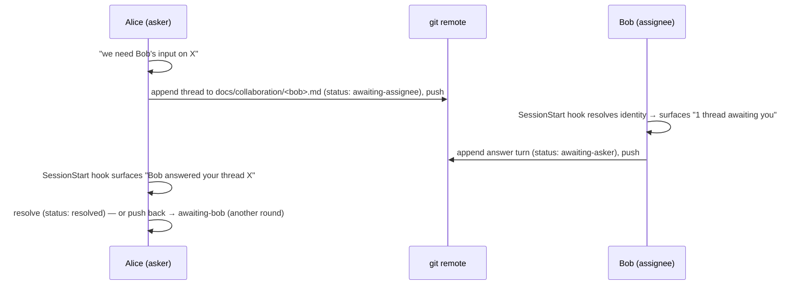
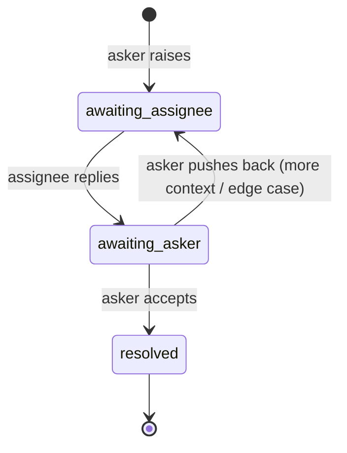

# Async team collaboration for init-project (git-mediated)

## Overview

Scaffold a **git-mediated async collaboration** capability into projects created by `/init-project`. It lets distributed teammates "pair program" without talking directly: Claude **brokers questions and handoffs** between them through committed docs + a SessionStart hook. Person A says "we need Bob's input on this"; Claude captures the question (with rich context) into Bob's inbox; next time Bob opens a session his hook surfaces it; Bob answers; A pulls and sees the answer — or pushes back for another round.

Three pieces ship into every scaffolded project:
1. **`docs/collaboration.md`** — the protocol standard (the contract Claude follows).
2. A **SessionStart hook** (`.claude/`) — read-only: resolves who you are (git identity) and surfaces threads where it's your turn.
3. **`docs/team.md`** — a lightweight registry / org chart, plus per-person thread inboxes under `docs/collaboration/`.

This **adds** a capability; it revises nothing in fn-2, but builds on fn-2's `.claude/` hook + `settings.json` (R18/R15), `_CLAUDE.md` + Standards index (R9/R12/R17), `docs/` model (R16), README (R19), and the build-time-complete template contract (R23).

## Architecture

The engine is deterministic and minimal; the protocol is prose Claude follows (the user accepted **hook-for-boot + prose-for-behavior**). Critically, the **hook only reads** — Claude does every write (per `collaboration.md`), keeping the hook fast, non-blocking, idempotent, and network-free.



**Status state machine** (turn-aware; **only the asker resolves**):



## Data model

- **`docs/team.md`** — a **fixed markdown table** the hook parses, columns: `handle | name | git-email | computer-name | reports-to` (`handle` = the stored git-email slug; `git-email` is the identity key; `computer-name` a secondary hint; `reports-to` → a lightweight org chart). Built incrementally as people identify themselves.
- **Handle** — a person's stable key = a **slug of their git-email** (lowercase; every non-`[a-z0-9]` run → a single `-`; trim leading/trailing `-`). Used for inbox filenames and in the `asker`/`assignee` fields. Defined once in `collaboration.md`.
- **Thread** — an append-only conversation in the assignee's inbox `docs/collaboration/<assignee-handle>.md`. It opens with a fixed **thread-header** line `## thread:<id> | asker:<handle> | assignee:<handle> | subject:<text>` — `asker`/`assignee` are set once and **never change** — followed by its turns.
- **Turn** — an appended block led by an **ASCII** header line `### turn <n> | author:<handle> | status:<enum> | <iso-ts>` then a free-form markdown body (liberal context). `<n>` is the **per-thread monotonic counter** (the ordering key; wall-clock is DISPLAY-ONLY — remote clocks/timezones are unreliable). `status` ∈ `awaiting-assignee | awaiting-asker | resolved`.
- **Effective status = the highest-`n` turn's `status`** (append-only: status is NEVER edited in place — a new turn supersedes the previous one). Routing reads the thread-header `asker`/`assignee` handles + the latest turn's status. Concurrent appends to the *same* thread are resolved by **re-pull + re-append** (deterministic by `<n>`), never hand-merged. (Documented upgrade if collisions get frequent: thread-per-file `docs/collaboration/threads/<id>.md` with `asker/assignee/status` frontmatter.)

## Quick commands

```bash
# Scaffold-test suite (must stay green; new assertions land here)
bash plugins/init-project/tests/scaffold_test.sh
# Lint the new hook
shellcheck plugins/init-project/templates/.claude/hooks/collaboration-inbox.sh
bash -n plugins/init-project/templates/.claude/hooks/collaboration-inbox.sh
# Confirm the new template files are actually git-tracked (the scaffolded .gitignore applies in this repo too)
git ls-files --error-unmatch plugins/init-project/templates/docs/collaboration.md plugins/init-project/templates/docs/team.md plugins/init-project/templates/docs/collaboration/.gitkeep plugins/init-project/templates/.claude/hooks/collaboration-inbox.sh
```

## Boundaries / non-goals

- **No real-time / network transport** — collaboration moves only through `git push`/`pull`. The hook NEVER fetches; freshness is "as of your last pull."
- **No automatic writes by the hook** — the hook is read-only/advisory; Claude performs all thread/team.md writes per the protocol.
- **Not a replacement for `/dick` or flow specs** — `docs/priorities.md` = business roadmap (`/dick`), `docs/todo.md` = my own engineering loose ends, `docs/collaboration/` = questions/handoffs aimed at a specific teammate. Three distinct surfaces.
- **No new identity store** — identity is `git config user.email`; we do not invent accounts/auth.
- **Default-on, not opt-in** — ships in every scaffold; harmless (silent) when no team/inboxes exist yet. (No `_optional/` subtree, no opt-in flag.)

## Decision context

- **Git identity as the key** (locked): **`user.email` is the single match key** (and the `handle`-slug source); `user.name` is **display-only, used only after the email identity is confirmed**, never a match key; hostname a secondary hint — survives machine changes and dev containers (where the container hostname differs from the host). The hook reads identity at the **project root** (`git -C <project_root> config --get user.email`), resolving repo-local→global. **Confirm-before-attribute**: the hook never silently assumes; an unknown/unregistered email surfaces a register advisory, and Claude confirms before writing anything attributed. Dev containers may have NO `.gitconfig` unless mounted → treat "no `user.email`" as a graceful, non-attributing (silent) state.
- **Hook reads, Claude writes** (locked): keeps the hook <1s, non-blocking, idempotent, network-free (SessionStart re-fires on resume/clear/compact). Writes are model behavior governed by `collaboration.md` + a thin `_CLAUDE.md` directive.
- **Project-level settings, not a plugin hook**: a *plugin* SessionStart hook's `additionalContext` does not reach Claude (issue #16538); wiring the hook in the scaffolded project's `.claude/settings.json` (project settings) DOES inject stdout as context. The scaffold ships it as a project hook for that reason.
- **Per-assignee threadfile** (locked v1): matches the "Bob's inbox" mental model; append-only turns + monotonic counters keep merges sane. Thread-per-file noted as the documented upgrade path.
- **Only the asker resolves** (locked): an assignee reply flips to `awaiting-asker`, never `resolved`, so multi-round back-and-forth works; a push-back is just another turn.
- **PII reality**: `team.md` (names, machines, org chart) and `collaboration/*.md` (discussion) are committed + pushed and live in history permanently (`git rm` doesn't erase it). The docs carry an explicit **private-repo-only** caveat + data-minimization note.

## Acceptance Criteria

- **R1:** The scaffold ships a **`docs/collaboration.md`** protocol standard defining the full model: identity resolution, the team registry, the thread/turn/status model, the trigger, the round-trip, and the private-repo/PII caveat. It is build-time-complete prose (R23), H&G-free, and authored in the existing standards-doc style.
- **R2:** **Identity is keyed on `git config --get user.email`** — the email is the single match key (and the source of the `handle` slug); `user.name` is a **display value only, never a match key**; computer/hostname is a secondary hint only. The model survives machine changes and dev containers. A **missing `user.email` is a graceful, non-attributing state even if `user.name` is set** (no crash, no guess).
- **R3:** **Confirm-before-attribute** with three explicit identity cases: (a) **no `user.email`** (even if `user.name` is set) → hook stays silent (nothing to attribute); (b) **`user.email` present but absent from `team.md`** → advisory (in the SessionStart `additionalContext` envelope) inviting the person to register (Claude then asks who they are **and who they report to**, recording both in `docs/team.md` — the first-run path); (c) **identity in `team.md`** → recognized, no prompt. Neither the hook nor Claude ever silently assumes an unconfirmed identity before writing attributed content.
- **R4:** **`docs/team.md`** is a registry/org chart in a **fixed, hook-parseable markdown table** with columns `handle | name | git-email | computer-name | reports-to` (`handle` = stored git-email slug; `git-email` the key). Ships as a build-time-complete stub: a GitHub-style markdown table (header row + `|---|` separator row) with one person per row (`| handle | name | git-email | computer-name | reports-to |`, cells trimmed), plus one example row using **obviously-fake placeholder data** (e.g. `alice` / `alice@example.com`). The hook parses exactly this table: skip the header + separator rows; the placeholder example row is harmless (never matches a real `user.email`). **`handle` is unique**: registration detects a slug collision (two distinct emails → same slug) and stops with a clear instruction to pick a disambiguated handle, so inboxes/routing are never ambiguous.
- **R5:** A collaboration item is an **append-only thread** in `docs/collaboration/<assignee-handle>.md` (handle = a defined git-email slug). It opens with a fixed thread-header (`## thread:<id> | asker:<handle> | assignee:<handle> | subject:…`) and appends turns each led by an ASCII header `### turn <n> | author:<handle> | status:<enum> | <iso-ts>`. Turn ordering is the **per-thread monotonic counter `<n>`** (wall-clock display-only); `asker`/`assignee` never change after the opener.
- **R6:** **Turn-aware status** is a fixed enum carried PER TURN — `awaiting-assignee | awaiting-asker | resolved` — and a thread's **effective status is its highest-`n` turn's status** (never mutated in place). Routing uses the thread-header `asker`/`assignee` **handles** (slugs, NOT display names). **Only the asker resolves**; an assignee reply appends `awaiting-asker` (never `resolved`); a push-back (more context / an edge case to explore) appends `awaiting-assignee` — supporting unbounded rounds.
- **R7:** **Trigger** — when the user says (in any conversation) "we need X's input" / "get X's input on this", Claude recognizes the intent, fuzzy-matches X against `docs/team.md` (offering to add X if absent), and appends a new thread to X's inbox with **liberally-included context** so the assignee can dig into specifics. Optionally it may re-enter a targeted `/flow-next:interview`, but the core mechanism is: broker the Q&A and persist the answer to the right artifact (spec/task via `flowctl`, code, or a decision doc) plus the thread turn.
- **R8:** A **read-only SessionStart hook** in the scaffolded `.claude/` surfaces by whose turn it is, via this algorithm: per inbox, group turns by thread `id`, take the **highest-`n` turn per thread**, and route ONLY off that latest turn's status + the thread-header handles — to a thread's `assignee` when latest status is `awaiting-assignee`, to its `asker` when `awaiting-asker` (so a superseded earlier status never re-alerts). It resolves the current identity to a handle (via the `team.md` table), parses each inbox **top-to-bottom as a streaming parse** — a `## thread:` header starts the current thread and the following `### turn` lines belong to it until the next header (so a multi-thread file never mixes turns) — emits via SessionStart **`additionalContext`** (project-level settings, so it reaches the session), is **fast (<1s), non-blocking, idempotent, performs NO network/`git fetch`**, and always exits 0. Degradation follows R3's identity cases: **no `user.email` → silent**; **email not in `team.md` → advisory**; **no inbox / no pending for me → silent**. ALL non-empty output (surfaced threads OR the register advisory) uses the SAME `{"hookSpecificOutput":{"hookEventName":"SessionStart","additionalContext":"…"}}` envelope so it reaches Claude uniformly; only the silent cases emit nothing. The `additionalContext` (free-form markdown — quotes, backslashes, newlines) MUST be **JSON-escaped with a robust encoder** (e.g. `jq -Rs`/`jq -n --arg`); when `jq` is unavailable the hook falls back to raw-text stdout (also injected by SessionStart) rather than risk emitting malformed JSON. Identity is read at the project root (`git -C <project_root> …`).
- **R9:** The hook **coexists with the existing Stop hook** — added as a sibling `hooks.SessionStart` key in `.claude/settings.json` (never nested under / replacing `hooks.Stop`), alongside the existing `statusLine`. A regression check proves `hooks.Stop` survives.
- **R10:** **Freshness is honest** — when the hook DOES emit collaboration context, it appends "as of your last pull" and suggests `git pull` rather than fetching; freshness text appears **only alongside surfaced context** (a no-pending session stays silent, never emits bare freshness). `@{u}`/upstream probes are guarded (no-upstream / detached HEAD never error the hook).
- **R11:** **`_CLAUDE.md` gets only thin wiring** — a Standards-index row for `docs/collaboration.md` (+ `docs/team.md`), a short `### Async collaboration` working-agreement directive (pointer to the doc, no protocol detail inline), and the doc-inventory line updated. The full protocol stays in `docs/collaboration.md`.
- **R12:** **Three note-surfaces stay non-overlapping** — `docs/collaboration.md`/`collaboration/` (teammate handoffs), `docs/todo.md` (my engineering loose ends), `docs/priorities.md` (business roadmap, `/dick`) each carry a one-line scope boundary cross-referencing the others.
- **R13:** **README + dev-container** updated — a human-facing collaboration mention with the **private-repo/PII caveat**; `docs/dev-container.md` notes the SessionStart hook location and the per-user git-identity setup the feature relies on.
- **R14:** **Tests** — `scaffold_test.sh` asserts (structural): all new files land in a fresh scaffold (collaboration.md, team.md, collaboration/.gitkeep, the hook script), the hook is executable + `# Description:` + `set -uo pipefail` + `bash -n` clean + contains no `git fetch`/`git pull`, `settings.json` has `hooks.SessionStart` AND still has `hooks.Stop` + `statusLine`, `_CLAUDE.md` links `docs/collaboration.md`, the README caveat is present. PLUS a **behavioral block**: run the hook inside a temp scaffold with a configured git identity + fixture `team.md`/`collaboration/*.md`, pipe stdout to `jq`, and assert `hookSpecificOutput.hookEventName=="SessionStart"` and the expected `additionalContext` for latest-turn routing (awaiting→answered→resolved does NOT alert), asker routing, unknown-identity advisory, no-pending silence, and a guarded upstream (no `@{u}` error). The suite stays green.
- **R15:** **Build-time-complete + git-tracked** — every new template file is fully-authored prose (no runtime LLM-fill, R23) and is verified **git-tracked** in the plugin repo (the scaffolded `.gitignore` applies here too — guard the silent-drop gotcha). Per-person inboxes are operator-created at runtime (only `collaboration/.gitkeep` ships), so they never collide with a manifest-owned template path.

## Early proof point

Task **fn-7-async-team-collaboration-for-init.2** validates the keystone: the **SessionStart hook actually resolves git identity and surfaces a "your turn" item via `additionalContext` in a real session**, coexisting with the Stop hook. If a project-level SessionStart hook can't reliably inject that context (the issue-#16538 risk, which we believe is plugin-only), the whole boot premise fails and we rethink before building the wiring/tests. This runtime injection is a **manual evidence item on .2** (a real scaffolded session showing the SessionStart context) — distinct from the automated tests, which verify the hook's *output shape* (.4). The protocol doc (.1) defines the contract it implements.

## Requirement coverage

| Req | Description | Task(s) | Gap justification |
|-----|-------------|---------|-------------------|
| R1  | collaboration.md protocol standard | .1 | — |
| R2  | Git-identity key (+ hostname hint, container-safe) | .1, .2 | — |
| R3  | Confirm-before-attribute + first-run who/reports-to | .1, .2 | — |
| R4  | team.md registry / org chart | .1 | — |
| R5  | Append-only thread/turn model + monotonic counter | .1 | — |
| R6  | Turn-aware status; only-asker-resolves; multi-round | .1 | — |
| R7  | "get X's input" trigger + liberal context | .1, .3 | — |
| R8  | Read-only SessionStart hook, additionalContext, fast/non-blocking | .2 | — |
| R9  | Coexist with Stop hook in settings.json | .2 | — |
| R10 | Honest freshness (no fetch; guarded @{u}) | .2 | — |
| R11 | Thin _CLAUDE.md wiring | .3 | — |
| R12 | Three-surface non-overlap cross-refs | .3 | — |
| R13 | README + dev-container + PII caveat | .3 | — |
| R14 | scaffold_test assertions | .4 | — |
| R15 | Build-time-complete + git-tracked | .1, .4 | — |
